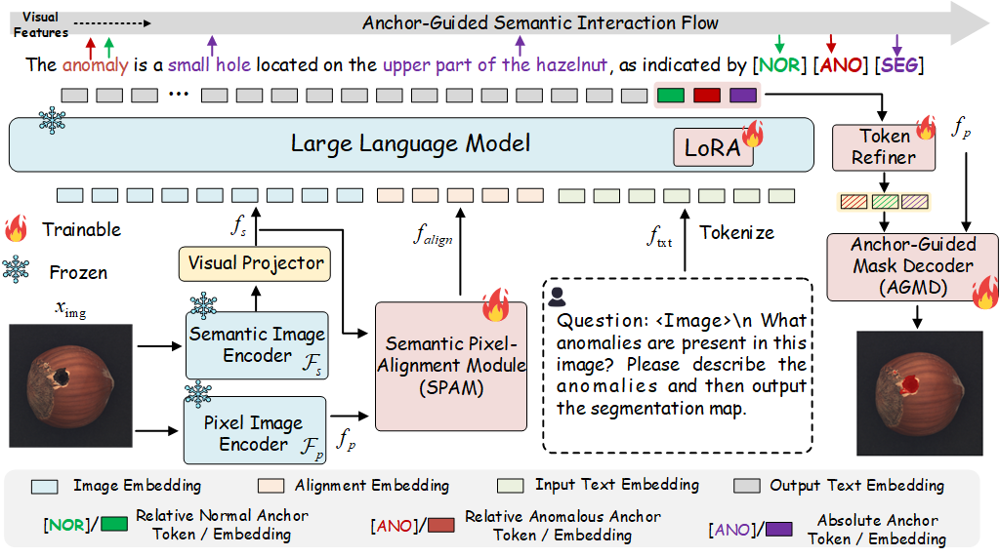

### **AG-VAS: Anchor-Guided Zero-Shot Visual Anomaly Segmentation with Large Multimodal Models (CVPR 2026)**



Zhen Qu, Xian Tao, Xiaoyi Bao, Dingrong Wang, ShiChen Qu, Zhengtao Zhang, Xingang Wang

[Paper link](https://arxiv.org/pdf/2603.01305)

Large multimodal models (LMMs) exhibit strong task generalization capabilities, offering new opportunities for zero-shot visual anomaly segmentation (ZSAS). However, existing LMM-based segmentation approaches still face fundamental limitations: anomaly concepts are inherently abstract and context-dependent, lacking stable visual prototypes, and the weak alignment between high-level semantic embeddings and pixel-level spatial features hinders precise anomaly localization.
To address these challenges, we present AG-VAS (Anchor-Guided Visual Anomaly Segmentation), a new framework that expands the LMM vocabulary with three learnable semantic anchor tokens—[SEG], [NOR], and [ANO], establishing a unified anchor-guided segmentation paradigm. Specifically, [SEG] serves as an absolute semantic anchor that translates abstract anomaly semantics into explicit, spatially grounded visual entities (e.g., holes or scratches), while [NOR] and [ANO] act as relative anchors that model the contextual contrast between normal and abnormal patterns across categories. To further enhance cross-modal alignment, we introduce a Semantic-Pixel Alignment Module (SPAM) that aligns language-level semantic embeddings with high-resolution visual features, along with an Anchor-Guided Mask Decoder (AGMD) that performs anchor-conditioned mask prediction for precise anomaly localization.
In addition, we curate Anomaly-Instruct20K, a large-scale instruction dataset that organizes anomaly knowledge into structured descriptions of appearance, shape, and spatial attributes, facilitating effective learning and integration of the proposed semantic anchors. Extensive experiments on six industrial and medical benchmarks demonstrate that AG-VAS achieves consistent state-of-the-art performance in the zero-shot setting.
## Table of Contents
* [📖 Introduction](#introduction)
* [🔧 Environments](#environments)
* [📊 Data Preparation](#data-preparation)
* [🚀 Run Experiments](#run-experiments)
* [🔗 Citation](#citation)
* [🙏 Acknowledgements](#acknowledgements)
* [📜 License](#license)

## Introduction
**This repository contains source code for AG-VAS implemented with PyTorch （Accepted by CVPR 2026）.** 


## Environments
Create a new conda environment and install required packages.
```
conda create -n llava_ov python=3.10
conda activate llava_ov
conda install pytorch==2.1.2 torchvision==0.16.2 torchaudio==2.1.2 pytorch-cuda=12.1 -c pytorch -c nvidia
conda env create -f environment.yml
```


## Acknowledgements
We thank the great works [WinCLIP(zqhang)](https://github.com/zqhang/Accurate-WinCLIP-pytorch),  [WinCLIP(caoyunkang)](https://github.com/caoyunkang/WinClip), [RegAD](https://github.com/MediaBrain-SJTU/RegAD), [VCP-CLIP](https://github.com/xiaozhen228/VCP-CLIP),  [APRIL-GAN](https://github.com/ByChelsea/VAND-APRIL-GAN), [Bayes-PFL](https://github.com/xiaozhen228/Bayes-PFL), [FastRecon](https://github.com/FzJun26th/FastRecon), [AnomalyGPT](https://github.com/CASIA-IVA-Lab/AnomalyGPT), [PromptAD](https://github.com/FuNz-0/PromptAD), [MetaUAS](https://github.com/gaobb/MetaUAS) and [ResAD](https://github.com/xcyao00/ResAD) for assisting with our work.

## Todo list
- [x] Release our AG-VAS paper
- [ ] Release our training code of DictAS
- [ ] Release our model weights
- [ ] Release our training code of DictAS
- [ ] ---

## License
The code and dataset in this repository are licensed under the [MIT license](https://mit-license.org/).


